# Design Document: Local-Play Two-Player Spinner Game
## Version: 1.0
## Date: 2026-03-15
## Author: Design Agent
## Target Platforms: Web (Desktop, Tablet, Mobile)
## Accessibility Standard: WCAG 2.2 AA
## Status: Pending PO Validation

---

## Table of Contents
1. Executive Summary
2. Personas Summary
3. Navigation Architecture
3.1 Global Navigation Model
3.2 Screen Hierarchy / Sitemap
3.3 Navigation Patterns
3.4 Sitemap Diagram (Mermaid)
4. User Journey Maps
4.1 Player 1 (Male) — Complete Turn-Based Gameplay
4.2 Player 1 (Male) — Live Session Configuration
4.3 Player 2 (Female) — Complete Turn-Based Gameplay
4.4 Player 2 (Female) — Pause, Resume, and Return
5. Screen-by-Screen Wireframe Descriptions
5.1 SCR-001: Gameplay Screen
5.2 SCR-002: Dashboard Shell
5.3 SCR-003: Round Management Panel
5.4 SCR-004: Spinner Content Management Panel
5.5 SCR-005: Rules Editor Panel
5.6 SCR-006: Spinner Entry Editor Modal
6. Process Flow Diagrams
6.1 FLOW-001: App Initialization and State Hydration
6.2 FLOW-002: Spin Execution and Turn Alternation
6.3 FLOW-003: Round Progression and Final-Round Infinite Loop
6.4 FLOW-004: Live Dashboard Edit Propagation
6.5 FLOW-005: Pause/Resume and Session Continuity
6.6 FLOW-006: Add Optional Round (5 and 6)
7. Data Flow Documentation
7.1 DATA-001: Local Storage Hydration on App Load
7.2 DATA-002: Spin Result Generation and Rendering
7.3 DATA-003: Opponent Last-Turn History Update
7.4 DATA-004: Dashboard Rule/Round/Spinner Edit Sync
7.5 DATA-005: Spinner Image Input Handling (Upload and URL)
7.6 DATA-006: Round Addition with Previous-Round Cloning
7.7 DATA-007: Pause/Resume State Persistence
8. Assumptions & Clarifications Log
9. Design Notes & Recommendations
10. Requirements Traceability Matrix
11. Self-Validation Report

---

## 1. Executive Summary
This design defines a single-page, browser-based, local-play game for two predefined players (Player 1 male, Player 2 female) on one shared device/session. Gameplay enforces strict alternation and executes exactly three spinner outcomes per turn in fixed order: Part, Action, Timer. A no-auth dashboard enables live editing of round names, spinner entries (text and image), and free-text rules. State and configuration persist in browser local storage and restore across sessions on the same browser profile. Round progression uses fixed non-editable per-round quotas and auto-advances in top-to-bottom order. After the final configured round, gameplay continues indefinitely in that round until paused.

## 2. Personas Summary
| Persona | Description | Primary Goals | Constraints | Access Scope |
|---|---|---|---|---|
| Player 1 (Male) | Predefined participant identity. | Complete valid turns, track round/active player, continue play. | Can spin only on active turn; fixed round quotas; shared device flow. | Full app access (Gameplay + Dashboard), no auth barriers. |
| Player 2 (Female) | Predefined participant identity. | Alternate fairly, view opponent last turn text history, resume reliably. | Can spin only on active turn; same shared session rules. | Full app access (Gameplay + Dashboard), no auth barriers. |

## 3. Navigation Architecture

### 3.1 Global Navigation Model
- Primary navigation: `Gameplay`, `Dashboard`.
- Secondary navigation inside Dashboard: `Rounds`, `Spinners`, `Rules`.
- Role-based differences: none; both personas see identical navigation and controls per [SOW-REQ-017].
- Breadcrumb logic:
  - Gameplay root: `Home / Gameplay`.
  - Dashboard sections: `Home / Dashboard / {Rounds|Spinners|Rules}`.
  - Spinner entry modal: `Home / Dashboard / Spinners / Entry Editor`.

### 3.2 Screen Hierarchy / Sitemap
- App Root
- SCR-001 Gameplay Screen
- SCR-002 Dashboard Shell
- SCR-003 Round Management Panel (child of SCR-002)
- SCR-004 Spinner Content Management Panel (child of SCR-002)
- SCR-005 Rules Editor Panel (child of SCR-002)
- SCR-006 Spinner Entry Editor Modal (overlay on SCR-004)

### 3.3 Navigation Patterns
- Progressive disclosure: Spinner entry details open in modal (SCR-006) from list view (SCR-004).
- Deep-linking [ASSUMPTION]: URL hash/query supports direct opening of Dashboard subpanels; proposed default `/dashboard?tab=spinners`.
- State preservation: Switching between Gameplay and Dashboard does not reset active round, turn counters, or in-progress session state.
- Exit points:
  - Dashboard to Gameplay via persistent top navigation.
  - Modal close returns to SCR-004 with current filters and scroll position preserved.

### 3.4 Sitemap Diagram (Mermaid)
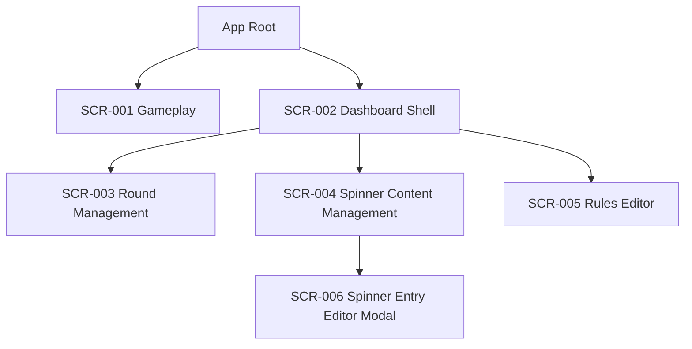

## 4. User Journey Maps

### 4.1 Player 1 (Male) — Complete Turn-Based Gameplay
**Trigger / Entry Point:** Player 1 is active on SCR-001.

**Step UJ-P1-Step-1:** Screen `SCR-001`.
- Action: Player 1 reviews active-player and current-round indicators.
- System Response: UI highlights `Active Player: Player 1` and current round label.
- Requirement tags: [SOW-REQ-001], [SOW-REQ-022].

**Step UJ-P1-Step-2:** Screen `SCR-001`.
- Action: Player 1 clicks `Spin`.
- System Response: System verifies active turn ownership.
- Decision Points:
  - Path A: Player 1 is active -> continue to spin execution.
  - Path B: Not active -> block action and keep state unchanged.
- Requirement tags: [SOW-REQ-002].

**Step UJ-P1-Step-3:** Screen `SCR-001`.
- Action: Await spin results.
- System Response: Produce exactly three outcomes in order Part -> Action -> Timer, each uniform-random from active-round spinner pool.
- Error / Edge Cases:
  - [EDGE CASE] Empty spinner pool -> fallback text equals spinner name.
- Requirement tags: [SOW-REQ-003], [SOW-REQ-004], [SOW-REQ-005].

**Step UJ-P1-Step-4:** Screen `SCR-001`.
- Action: Player reads result cards.
- System Response: Show text and image when both exist; text-only when image missing.
- Requirement tags: [SOW-REQ-006].

**Step UJ-P1-Step-5:** Screen `SCR-001`.
- Action: Turn completes.
- System Response: Update turn counters, switch active player to Player 2, refresh history panel for next player with only opponent’s most recent prior turn text values.
- Error / Edge Cases:
  - [EDGE CASE] No opponent prior turn yet -> history panel blank.
- Requirement tags: [SOW-REQ-001], [SOW-REQ-007], [SOW-REQ-008], [SOW-REQ-022].

**Step UJ-P1-Step-6:** Screen `SCR-001`.
- Action: System evaluates round completion.
- System Response:
  - Path A: Both players met quota -> auto-advance next round immediately in dashboard order.
  - Path B: Quota incomplete -> remain in current round.
- Requirement tags: [SOW-REQ-012], [SOW-REQ-013], [SOW-REQ-014].

**Exit Point / Outcome:** Gameplay continues with Player 2 active; if final configured round reached, loop indefinitely in final round.
- Requirement tags: [SOW-REQ-015].

### 4.2 Player 1 (Male) — Live Session Configuration
**Trigger / Entry Point:** While session is active, Player 1 opens Dashboard from top nav.

**Step UJ-P1CFG-Step-1:** Screen `SCR-002` -> `SCR-003`.
- Action: Edit round names.
- System Response: Save instantly and reflect labels in gameplay indicators/live UI.
- Requirement tags: [SOW-REQ-018].

**Step UJ-P1CFG-Step-2:** Screen `SCR-002` -> `SCR-004` -> `SCR-006`.
- Action: Add/edit spinner entries for selected round/spinner type with text and optional image.
- System Response: Persist content and apply immediately to future spins.
- Requirement tags: [SOW-REQ-018].

**Step UJ-P1CFG-Step-3:** Screen `SCR-006`.
- Action: Choose image source.
- Decision Points:
  - Path A: Upload file.
  - Path B: Provide external URL.
- System Response: Store image reference/data and auto-fit for display.
- Error / Edge Cases:
  - [ASSUMPTION] Invalid URL keeps text usable and image placeholder shown by default.
- Requirement tags: [SOW-REQ-019].

**Step UJ-P1CFG-Step-4:** Screen `SCR-005`.
- Action: Edit free-text rules.
- System Response: Save/update rules text immediately in app context; no rule-engine execution.
- Requirement tags: [SOW-REQ-018], [SOW-REQ-021].

**Step UJ-P1CFG-Step-5:** Screen `SCR-003`.
- Action: Add optional rounds.
- System Response:
  - Default starts at 4 rounds.
  - Add Round 5 then 6 only.
  - New round clones previous round spinner entries, images, and fixed turn limit by position.
  - Auto-generated name (example: Round 5) until edited.
- Error / Edge Cases:
  - Add beyond 6 blocked.
  - Reordering/removal unavailable.
- Requirement tags: [SOW-REQ-009], [SOW-REQ-010], [SOW-REQ-011], [SOW-REQ-012], [SOW-REQ-013].

**Exit Point / Outcome:** Return to SCR-001; updates are already active without refresh.
- Requirement tags: [SOW-REQ-018], [SOW-REQ-020].

### 4.3 Player 2 (Female) — Complete Turn-Based Gameplay
**Trigger / Entry Point:** Player 2 becomes active after Player 1 completes turn.

**Step UJ-P2-Step-1:** Screen `SCR-001`.
- Action: Validate that it is Player 2’s turn.
- System Response: Active indicator shows Player 2, Spin enabled for Player 2 turn context only.
- Requirement tags: [SOW-REQ-001], [SOW-REQ-002], [SOW-REQ-022].

**Step UJ-P2-Step-2:** Screen `SCR-001`.
- Action: Review history panel before spinning.
- System Response: Display only Player 1’s most recent prior turn values (Part/Action/Timer text only) or blank if none.
- Requirement tags: [SOW-REQ-007], [SOW-REQ-008].

**Step UJ-P2-Step-3:** Screen `SCR-001`.
- Action: Click `Spin`.
- System Response: Execute Part -> Action -> Timer random outcomes with fallback labels for empty pools.
- Requirement tags: [SOW-REQ-003], [SOW-REQ-004], [SOW-REQ-005].

**Step UJ-P2-Step-4:** Screen `SCR-001`.
- Action: Complete turn and observe round/flow changes.
- System Response: Counter increments, active player switches back to Player 1, round auto-advance when both quotas met.
- Requirement tags: [SOW-REQ-001], [SOW-REQ-014], [SOW-REQ-022].

**Exit Point / Outcome:** Normal alternating loop continues or final round infinite continuation applies.
- Requirement tags: [SOW-REQ-015].

### 4.4 Player 2 (Female) — Pause, Resume, and Return
**Trigger / Entry Point:** Player 2 pauses an active session.

**Step UJ-P2PR-Step-1:** Screen `SCR-001`.
- Action: Click `Pause`.
- System Response: Freeze gameplay progression and preserve current round, active player, and turn state.
- Requirement tags: [SOW-REQ-016].

**Step UJ-P2PR-Step-2:** Browser reload/reopen.
- Action: Re-enter app on same browser profile/device.
- System Response: Restore persisted configuration and game state from local storage.
- Requirement tags: [SOW-REQ-020].

**Step UJ-P2PR-Step-3:** Screen `SCR-001`.
- Action: Click `Resume`.
- System Response: Resume alternating turn flow from exact saved point.
- Requirement tags: [SOW-REQ-016].

**Exit Point / Outcome:** Session continues from preserved state.
- [ASSUMPTION] If local storage is cleared/corrupted, app re-initializes with default 4 rounds and fixed quotas.

## 5. Screen-by-Screen Wireframe Descriptions

### 5.1 SCR-001: Gameplay Screen
**Purpose:** Execute turn-based play, display spin outcomes, indicate active player/current round, and expose pause/resume/history/dashboard access.  
**Persona(s):** Player 1 (Male), Player 2 (Female).  
**SOW Requirement(s):** [SOW-REQ-001], [SOW-REQ-002], [SOW-REQ-003], [SOW-REQ-004], [SOW-REQ-005], [SOW-REQ-006], [SOW-REQ-007], [SOW-REQ-008], [SOW-REQ-012], [SOW-REQ-013], [SOW-REQ-014], [SOW-REQ-015], [SOW-REQ-016], [SOW-REQ-018], [SOW-REQ-020], [SOW-REQ-022].

#### Layout Structure
- Header Zone: App title, `Gameplay` and `Dashboard` nav links, current round indicator, active player indicator.
- Sidebar Zone: Rules display card (free text), round progression summary.
- Primary Content Zone: Spin control area, three result cards in fixed order (Part, Action, Timer), pause/resume control.
- Secondary Content Zone: Opponent last-turn history panel (text-only values).
- Footer Zone: Session persistence status (`Saved locally`), last saved timestamp [ASSUMPTION default display].

#### Component Inventory
| Component | Type | Data Source | Interaction Behavior | States |
|---|---|---|---|---|
| Active Player Badge | Status chip | In-memory game state/local storage | Auto-updates after turn completion | Populated |
| Current Round Badge | Status chip | Current round index/name | Auto-updates on round advance | Populated |
| Spin Button | Primary button | N/A | Click to trigger ordered 3-spinner execution; blocked if non-active context | Enabled, Disabled, Busy |
| Result Card: Part | Content card | Active round Part entries | Displays selected text/image or fallback label | Loading, Populated, Fallback, Error |
| Result Card: Action | Content card | Active round Action entries | Same as above | Loading, Populated, Fallback, Error |
| Result Card: Timer | Content card | Active round Timer entries | Same as above | Loading, Populated, Fallback, Error |
| History Panel | Read-only panel | Opponent previous turn text snapshot | Auto-refresh after each completed turn | Blank, Populated |
| Pause/Resume Toggle | Secondary button | Session state | Pause freezes progression; resume re-enables turn flow | Pause mode, Resume mode |
| Dashboard Link | Nav button/link | N/A | Navigates to SCR-002 without resetting state | Default |

#### Primary Actions
- `Spin` (center primary): triggers FLOW-002; enabled only when active turn context is valid.
- `Pause` / `Resume` (near Spin): toggles play state per FLOW-005.
- `Dashboard` (header): navigates to SCR-002 for live edits.
- `Gameplay` (header): returns to SCR-001 from dashboard views.

#### Validation Rules
- Spin action guard: only active turn context can execute; else action blocked silently or with helper text `Wait for active turn`.
- Spinner fallback: if selected spinner pool is empty, show exact label `Part`, `Action`, or `Timer`.
- History guard: show only opponent last prior turn text values; never current player own values.

#### Responsive Behavior
- Desktop (>=1280px): Header fixed; two-column body (primary content + history/rules sidebar).
- Tablet (768-1279px): Header compact; primary content full width; history/rules stack below outcomes.
- Mobile (<=767px): Single-column vertical flow; result cards stacked in fixed Part->Action->Timer order; persistent sticky bottom Spin/Pause area.

#### Accessibility Notes [ACCESSIBILITY]
- Focus order: Skip link -> header nav -> active/round indicators -> Spin -> Pause/Resume -> result cards -> history panel -> rules.
- Keyboard: `Enter/Space` activate Spin/Pause/Resume; all actionable elements tabbable.
- Screen reader labels:
  - Spin button announces `Spin turn for [active player]`.
  - Round badge announces `Current round [name], quota [n] per player`.
- Non-color indicators: active player uses text label + icon, not color-only distinction.
- Result cards include accessible alt text for rendered images and always include textual counterpart.

### 5.2 SCR-002: Dashboard Shell
**Purpose:** Provide centralized no-auth access to round, spinner, and rules editing with immediate game impact.  
**Persona(s):** Player 1 (Male), Player 2 (Female).  
**SOW Requirement(s):** [SOW-REQ-017], [SOW-REQ-018], [SOW-REQ-020].

#### Layout Structure
- Header Zone: Global nav (`Gameplay`, `Dashboard`), title `Dashboard`.
- Sidebar Zone: Section switcher (`Rounds`, `Spinners`, `Rules`) in fixed order.
- Primary Content Zone: Active panel container rendering SCR-003/SCR-004/SCR-005.
- Secondary Content Zone: Live preview card [ASSUMPTION default] showing current round and sample result rendering.
- Footer Zone: Auto-save indicator and local-storage status.

#### Component Inventory
| Component | Type | Data Source | Interaction Behavior | States |
|---|---|---|---|---|
| Section Nav | Tab/segmented control | UI state | Switches panels without leaving dashboard route | Selected, Unselected |
| Panel Container | Dynamic region | UI state + local storage data | Loads selected management panel | Loading, Populated |
| Save Indicator | Status text | Save pipeline status | Updates after each edit mutation | Saving, Saved, Error |
| Return to Gameplay | Button/link | N/A | Navigate back to SCR-001 | Default |

#### Primary Actions
- `Rounds`, `Spinners`, `Rules` panel switches.
- `Gameplay` nav action returns to SCR-001 with unchanged game state.

#### Validation Rules
- No authentication gate; all users can access panel immediately.
- Unsaved state [ASSUMPTION]: edits commit on change/blur; no explicit save button needed.

#### Responsive Behavior
- Desktop: Left sidebar + right content split.
- Tablet: Top tab strip replaces sidebar.
- Mobile: Horizontal scroll tab strip; panel content full width.

#### Accessibility Notes [ACCESSIBILITY]
- Section switcher uses ARIA tab pattern (`role=tablist`, `role=tab`, `role=tabpanel`).
- Keyboard left/right (or up/down) changes selected tab.
- Save indicator announced with `aria-live="polite"` on state changes.

### 5.3 SCR-003: Round Management Panel
**Purpose:** Manage default/optional rounds, edit round names, enforce fixed quotas and ordering constraints.  
**Persona(s):** Player 1 (Male), Player 2 (Female).  
**SOW Requirement(s):** [SOW-REQ-009], [SOW-REQ-010], [SOW-REQ-011], [SOW-REQ-012], [SOW-REQ-013], [SOW-REQ-018].

#### Layout Structure
- Header Zone: Panel title `Rounds`, count badge (`4/6`, `5/6`, or `6/6`).
- Primary Content Zone: Round list in top-to-bottom order with editable name field and read-only quota badge per row.
- Secondary Content Zone: Constraint notes (`No reorder`, `No remove`, `Fixed quotas`).
- Footer Zone: `Add Round` button and helper text.

#### Component Inventory
| Component | Type | Data Source | Interaction Behavior | States |
|---|---|---|---|---|
| Round Rows | Editable list rows | Round collection | Inline rename updates immediately | Populated |
| Quota Badge | Read-only chip | Fixed quota map by position | Non-editable visual indicator | Populated |
| Add Round Button | Button | Round count | Appends next round until max 6 | Enabled (<6), Disabled (=6) |
| Constraint Notice | Info text | Static | Explains unsupported operations | Default |

#### Primary Actions
- Inline edit round name for each existing round.
- `Add Round` appends next round (Round 5 then Round 6).

#### Validation Rules
- Round name: free text; empty name [ASSUMPTION] defaults back to auto-generated `Round N`.
- Add limit: block at 6 total rounds with message `Maximum of 6 rounds reached`.
- No remove/reorder controls rendered.
- Quotas fixed by position: 10, 10, 5, 2, 2, 2 and non-editable.

#### Responsive Behavior
- Desktop: Table-like list with columns (`Order`, `Name`, `Quota`).
- Tablet: Card rows with inline name edit and quota chip.
- Mobile: Stacked cards; `Add Round` full-width bottom action.

#### Accessibility Notes [ACCESSIBILITY]
- Round rows announced with position context (`Round 3 of 6`).
- Quota chip includes text value; not color-only.
- Disabled `Add Round` button includes reason in `aria-describedby`.

### 5.4 SCR-004: Spinner Content Management Panel
**Purpose:** Manage per-round spinner entries (Part/Action/Timer), including text and image association.  
**Persona(s):** Player 1 (Male), Player 2 (Female).  
**SOW Requirement(s):** [SOW-REQ-003], [SOW-REQ-004], [SOW-REQ-005], [SOW-REQ-006], [SOW-REQ-018], [SOW-REQ-019].

#### Layout Structure
- Header Zone: `Spinners` panel title, selected round dropdown, spinner type segmented control (`Part`, `Action`, `Timer`).
- Sidebar Zone: Round quick-select list [ASSUMPTION optional duplicate selector].
- Primary Content Zone: Entry table/list for selected round and spinner type.
- Secondary Content Zone: Preview tile for selected entry with auto-fit behavior.
- Footer Zone: `Add Entry` button.

#### Component Inventory
| Component | Type | Data Source | Interaction Behavior | States |
|---|---|---|---|---|
| Round Selector | Dropdown/list | Round collection | Changes active content set | Populated |
| Spinner Type Toggle | Segmented control | Static enum | Filters entries by spinner type | Selected, Unselected |
| Entries List | Data list/table | Spinner entry collection | Edit/Delete via row actions; open modal on edit | Empty, Populated |
| Add Entry Button | Button | N/A | Opens SCR-006 in create mode | Enabled |
| Entry Preview | Card | Selected entry | Shows text + image fit preview | Empty, Populated |

#### Primary Actions
- `Add Entry` opens SCR-006.
- `Edit` row action opens SCR-006 populated.
- `Delete` row action removes entry with confirm [ASSUMPTION default confirm dialog].
- Round and spinner-type filters update visible entries.

#### Validation Rules
- Entry text optionality [ASSUMPTION]: at least one of text or image URL/upload must exist.
- Delete updates active spinner pool immediately for subsequent spins.
- Empty list allowed; gameplay fallback handles empty spinner pool labels.

#### Responsive Behavior
- Desktop: Filter controls top row; list + preview split.
- Tablet: Filters stack; preview below list.
- Mobile: Filters full-width; list cards with actions; preview inline under selected card.

#### Accessibility Notes [ACCESSIBILITY]
- Spinner type toggle keyboard-operable as radio group.
- Row action buttons labeled with entry context (`Edit Part entry 3`).
- Preview image includes alt text derived from entry text or fallback `Spinner entry image`.

### 5.5 SCR-005: Rules Editor Panel
**Purpose:** Edit and display free-text game rules with immediate propagation to gameplay context.  
**Persona(s):** Player 1 (Male), Player 2 (Female).  
**SOW Requirement(s):** [SOW-REQ-018], [SOW-REQ-021].

#### Layout Structure
- Header Zone: Title `Rules`.
- Primary Content Zone: Large multiline text area.
- Secondary Content Zone: Read-only live preview block as rendered in gameplay.
- Footer Zone: Auto-save status text.

#### Component Inventory
| Component | Type | Data Source | Interaction Behavior | States |
|---|---|---|---|---|
| Rules Textarea | Multiline input | Rules text string | Edits save on change/blur and propagate instantly | Empty, Populated |
| Preview Block | Read-only text panel | Same rules string | Reflects changes immediately | Empty, Populated |
| Save Status | Inline status | Save state | Announces save success/failure | Saving, Saved, Error |

#### Primary Actions
- Type/edit free-text rules.
- Return to gameplay and verify immediate update.

#### Validation Rules
- Free text only; no structured parsing or rule enforcement.
- [ASSUMPTION] Max character length 5000 to protect local storage size; if exceeded, show inline error `Rules text is too long`.
- Empty rules accepted.

#### Responsive Behavior
- Desktop: Textarea left, preview right.
- Tablet/Mobile: Textarea above preview in single column.

#### Accessibility Notes [ACCESSIBILITY]
- Textarea has explicit label and helper description.
- Character counter [ASSUMPTION if limit implemented] announced politely.
- Preview heading semantics (`h3`) for screen reader navigation.

### 5.6 SCR-006: Spinner Entry Editor Modal
**Purpose:** Create or edit a single spinner entry with text plus image via upload or URL.  
**Persona(s):** Player 1 (Male), Player 2 (Female).  
**SOW Requirement(s):** [SOW-REQ-006], [SOW-REQ-018], [SOW-REQ-019].

#### Layout Structure
- Header Zone: Modal title (`Add Entry` or `Edit Entry`) and close button.
- Primary Content Zone: Text input, image source mode selector (`Upload` / `URL`), corresponding input controls, preview.
- Secondary Content Zone: Validation messages.
- Footer Zone: `Cancel`, `Save Entry`.

#### Component Inventory
| Component | Type | Data Source | Interaction Behavior | States |
|---|---|---|---|---|
| Text Input | Single-line/multiline input | Entry text | Editable | Empty, Populated, Error |
| Image Mode Selector | Radio/segmented control | UI state | Switches between upload and URL input | Upload, URL |
| File Upload Control | File input | Local file | Reads image data for local persistence and preview | Empty, Selected, Error |
| URL Input | Text input | URL string | Validates URL format/reachability [ASSUMPTION format only at client] | Empty, Populated, Error |
| Preview Frame | Image/text preview | Entry draft | Auto-fit image within fixed frame | Empty, Populated |
| Save Entry | Button | Draft state | Commits entry to selected round/spinner | Enabled, Disabled |

#### Primary Actions
- Enter/modify text.
- Choose `Upload` or `URL` image source.
- Save or cancel modal.

#### Validation Rules
- `Save Entry` enabled when draft satisfies minimum content rule [ASSUMPTION: text or image required].
- URL mode validates absolute URL pattern; invalid URL -> inline error `Enter a valid image URL`.
- Upload mode validates supported image mime types [ASSUMPTION: jpg/png/webp/gif].
- Auto-resize fit applies before commit for display rendering consistency.

#### Responsive Behavior
- Desktop: Center modal with two-column form/preview.
- Tablet: Single-column within modal.
- Mobile: Full-screen sheet modal with sticky footer actions.

#### Accessibility Notes [ACCESSIBILITY]
- Modal traps focus until closed.
- `Esc` closes modal with cancel behavior.
- Image mode selector exposed as labeled radio group.
- Validation errors linked with `aria-describedby` on fields.

## 6. Process Flow Diagrams

### 6.1 FLOW-001: App Initialization and State Hydration
**Trigger:** User opens app URL.  
**Actors:** Player 1/Player 2, Browser App, Local Storage.

Step 1: [Player] opens app.
→ System: Bootstrap SPA and attempt local storage read.  
→ Data: Read persisted config + gameplay snapshot from local storage.  
→ Next: Step 2

Step 2: [Decision Point]
→ If persisted state exists and valid: hydrate state and render SCR-001 with restored context.  
→ If missing/invalid: initialize defaults (4 rounds; fixed quotas by position; empty or prior default spinner pools) [ASSUMPTION].  
→ If error: display non-blocking warning and continue with defaults.  
→ Next: Step 3

Step 3: [System] renders gameplay shell.
→ System: Show active player and current round indicators.  
→ Data: Write initialized/hydrated state back to in-memory store.  
→ Next: End

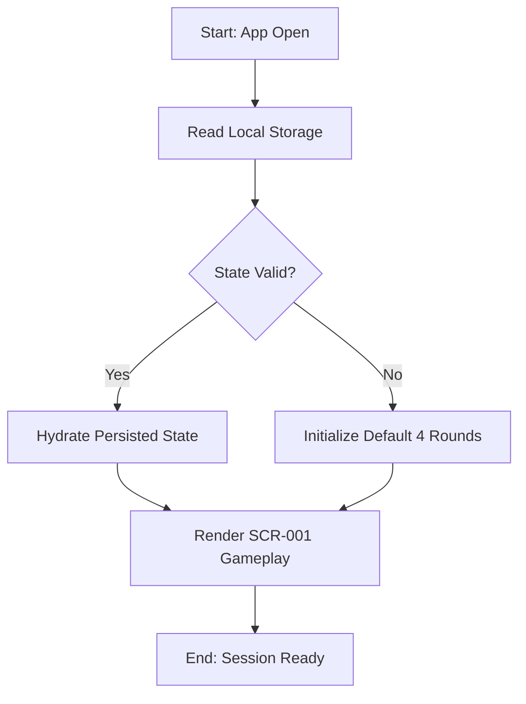

**Error Handling:** Parse/read failure falls back to default initialization; app remains usable.

### 6.2 FLOW-002: Spin Execution and Turn Alternation
**Trigger:** Active player clicks `Spin` on SCR-001.  
**Actors:** Active Player, Browser App.

Step 1: [Active Player] performs Spin click.  
→ System: Validate active-turn ownership.  
→ Data: Read active player id and pause state.  
→ Next: Step 2

Step 2: [Decision Point]
→ If not active/paused: block spin; show helper feedback.  
→ If valid: continue to Step 3.  

Step 3: [System] performs fixed ordered spinner selection.  
→ System: Resolve Part then Action then Timer using uniform random per spinner pool.  
→ Data: Read active round entries; write selected outcomes to current turn record.  
→ Next: Step 4

Step 4: [Decision Point]
→ If spinner pool empty for any type: set fallback label equal to spinner name.  
→ Else: use selected entry data (text/image).  
→ Next: Step 5

Step 5: [System] commits turn.  
→ System: Increment active player round counter; switch active player.  
→ Data: Write turn outcome and counters; persist snapshot.  
→ Next: Step 6

Step 6: [System] updates history and round progression checks.  
→ Data: Update opponent-last-turn text history artifact.  
→ Next: FLOW-003 decision path.

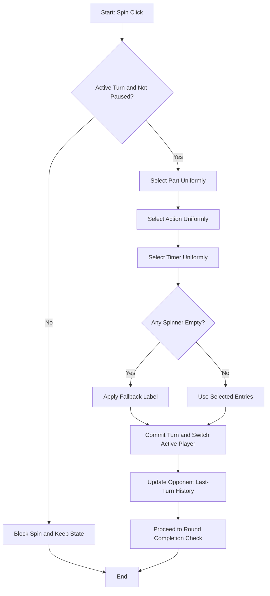

**Error Handling:** Spin blocked while paused/non-active; no counter mutation on blocked attempts.

### 6.3 FLOW-003: Round Progression and Final-Round Infinite Loop
**Trigger:** Post-turn completion in FLOW-002.  
**Actors:** Browser App.

Step 1: [System] evaluates current round quotas for both players.  
→ Data: Read per-player counters for active round.  
→ Next: Step 2

Step 2: [Decision Point]
→ If both players reached current round fixed quota: go to Step 3.  
→ If not: remain in current round and end.

Step 3: [System] evaluates next round availability by dashboard order.  
→ Data: Read configured round count and current index.  
→ Next: Step 4

Step 4: [Decision Point]
→ If next round exists: advance immediately to next round.  
→ If current round is final configured round: remain in same round indefinitely.  
→ Next: End

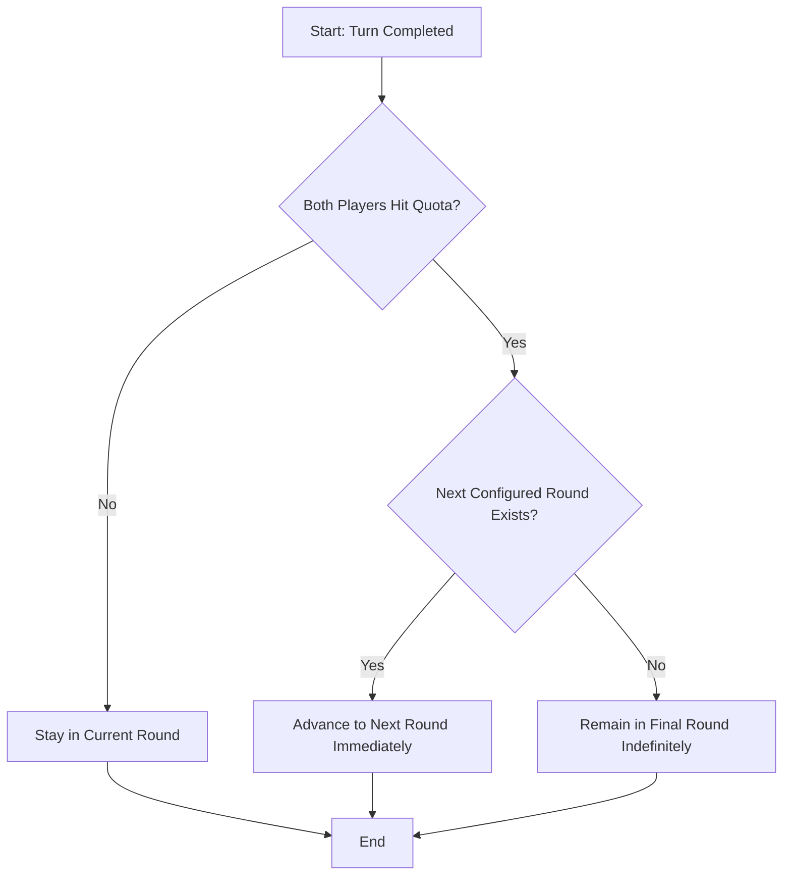

**Error Handling:** If counter inconsistency detected [ASSUMPTION], recompute from turn log snapshot and continue.

### 6.4 FLOW-004: Live Dashboard Edit Propagation
**Trigger:** User edits round names, spinner entries, or rules on dashboard panels.  
**Actors:** Player 1/Player 2, Browser App, Local Storage.

Step 1: [User] edits data in SCR-003/SCR-004/SCR-005/SCR-006.  
→ System: Validate field-level constraints.  
→ Data: Draft state in memory.  
→ Next: Step 2

Step 2: [System] commits change.  
→ System: Update central state store and local storage immediately.  
→ Data: Write modified rounds/rules/spinner entries.  
→ Next: Step 3

Step 3: [System] propagates live update.  
→ System: Gameplay UI (SCR-001) reflects changed labels/rules/spinner pools without refresh.  
→ Data: Consume updated state in active gameplay render cycle.  
→ Next: End

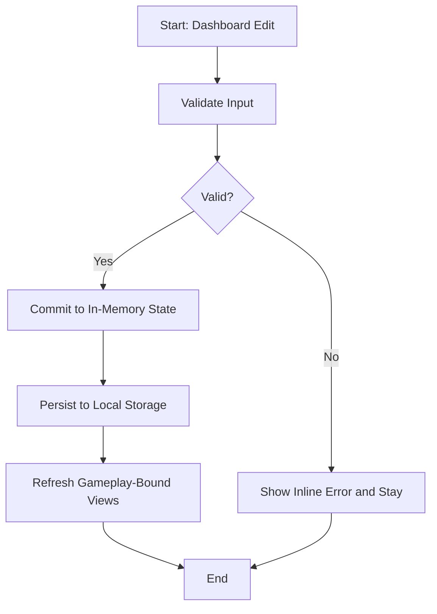

**Error Handling:** Validation errors are inline and non-destructive; previously saved state remains intact.

### 6.5 FLOW-005: Pause/Resume and Session Continuity
**Trigger:** User presses Pause or Resume.  
**Actors:** Player 1/Player 2, Browser App, Local Storage.

Step 1: [User] presses Pause on SCR-001.  
→ System: Set paused flag true; disable spin execution path.  
→ Data: Persist paused state + current turn/round context.  
→ Next: Step 2

Step 2: [User] reloads/closes/reopens app.  
→ System: Rehydrate paused session from local storage.  
→ Data: Read persisted state snapshot.  
→ Next: Step 3

Step 3: [User] presses Resume.  
→ System: Set paused flag false; re-enable spin flow at saved active player/round.  
→ Data: Persist resumed state.  
→ Next: End

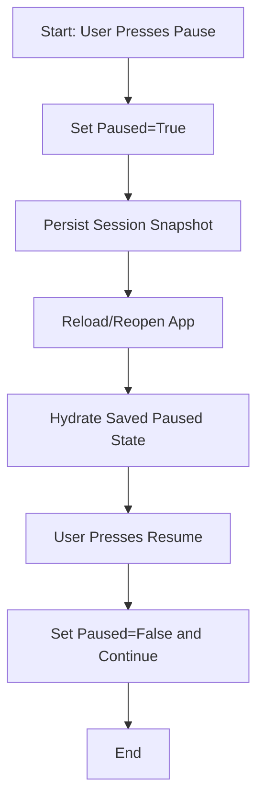

**Error Handling:** Missing snapshot on return loads default initialization behavior.

### 6.6 FLOW-006: Add Optional Round (5 and 6)
**Trigger:** User presses `Add Round` on SCR-003.  
**Actors:** Player 1/Player 2, Browser App, Local Storage.

Step 1: [User] clicks Add Round.  
→ System: Check current configured round count.  
→ Data: Read rounds array length.  
→ Next: Step 2

Step 2: [Decision Point]
→ If count >= 6: block and show max reached message.  
→ If count < 6: continue clone operation.

Step 3: [System] creates new round from previous round.
→ System: Copy spinner entries and image data from immediately previous round.  
→ Data: Clone previous round payload; assign fixed quota by new position; set auto-name `Round N`.  
→ Next: Step 4

Step 4: [System] persist and render.
→ Data: Write updated rounds to local storage.  
→ System: Show appended round at bottom in fixed order, editable name field.  
→ Next: End

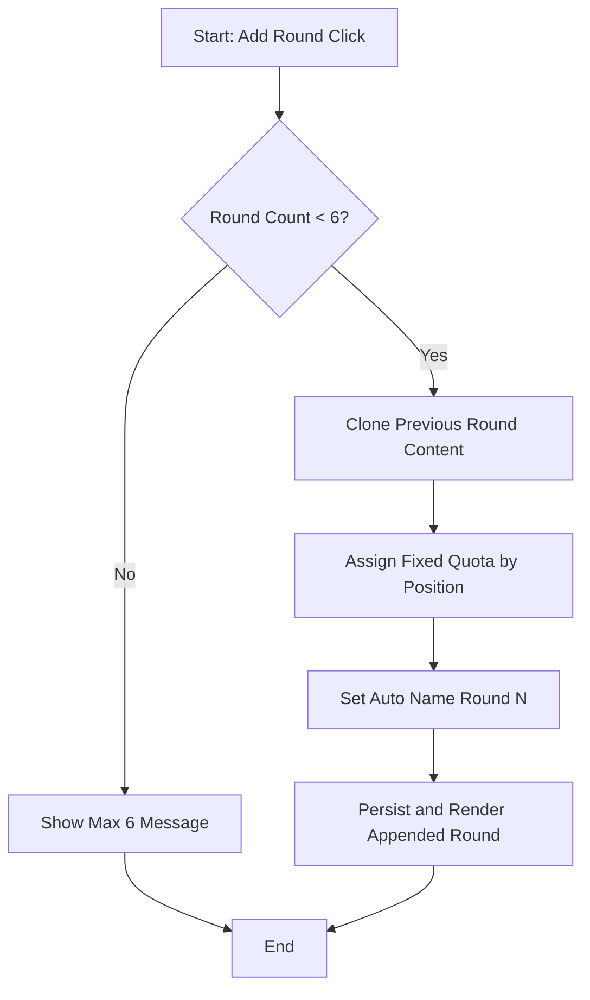

**Error Handling:** Clone failure [ASSUMPTION] shows non-blocking error and keeps prior rounds unchanged.

## 7. Data Flow Documentation

### 7.1 DATA-001: Local Storage Hydration on App Load
**Flow ID:** DATA-001  
**Source:** Browser local storage keys for config and game state.  
**Transformations:** Parse JSON, validate shape, default fallback initialization when invalid/missing.  
**Destination:** In-memory app state used by SCR-001 and SCR-002.  
**Payload Summary:** rounds, round names, fixed quotas by index, spinner entries (text/image refs), rules text, active player, active round, turn counters, pause flag, history snapshot.  
**Trigger:** Initial app load/reload.

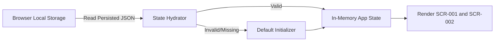

### 7.2 DATA-002: Spin Result Generation and Rendering
**Flow ID:** DATA-002  
**Source:** Active round spinner entry collections and active player action (`Spin`).  
**Transformations:** Uniform random selection per spinner; fixed order evaluation Part->Action->Timer; fallback substitution for empty pools.  
**Destination:** Current turn result model and SCR-001 result cards.  
**Payload Summary:** `{part:{text,image?}, action:{text,image?}, timer:{text,image?}, fallbackFlags}`.  
**Trigger:** Valid Spin click by active player.

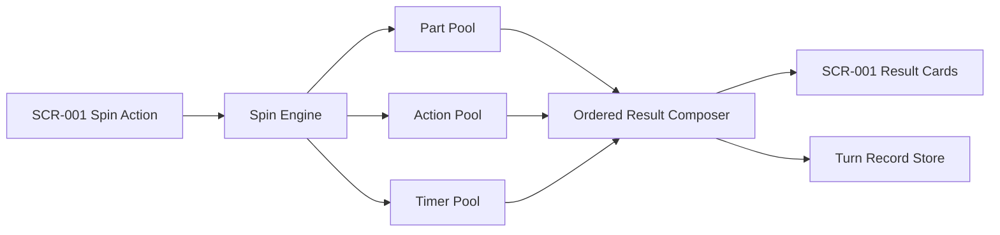

### 7.3 DATA-003: Opponent Last-Turn History Update
**Flow ID:** DATA-003  
**Source:** Newly committed turn record after spin completion.  
**Transformations:** Extract only text fields Part/Action/Timer and assign as opponent-visible snapshot; omit images.  
**Destination:** SCR-001 history panel for next active player.  
**Payload Summary:** `{partText, actionText, timerText, sourcePlayer}`.  
**Trigger:** Turn commit event.

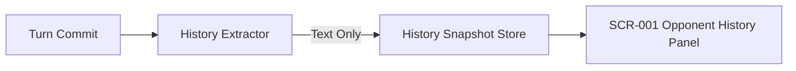

### 7.4 DATA-004: Dashboard Rule/Round/Spinner Edit Sync
**Flow ID:** DATA-004  
**Source:** User edits in SCR-003/SCR-004/SCR-005/SCR-006.  
**Transformations:** Field validation; merge mutation into canonical app state.  
**Destination:** Local storage and immediate gameplay-bound render state.  
**Payload Summary:** updated round names, rules string, spinner entries list updates, image references/data handles.  
**Trigger:** Field commit (change/blur/save action per control).

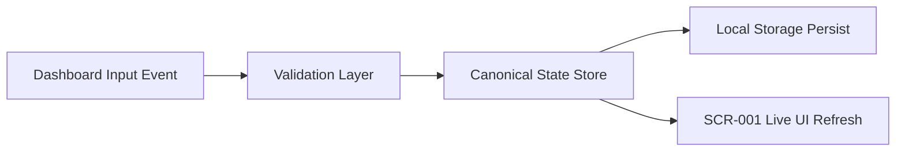

### 7.5 DATA-005: Spinner Image Input Handling (Upload and URL)
**Flow ID:** DATA-005  
**Source:** SCR-006 image input controls.  
**Transformations:** Branch by source mode; for upload read file data, for URL store validated URL string; generate display-fit metadata.  
**Destination:** Spinner entry record used in gameplay rendering and dashboard preview.  
**Payload Summary:** `{imageSourceType, imageDataOrUrl, fitMeta, entryText}`.  
**Trigger:** Save Entry action in SCR-006.

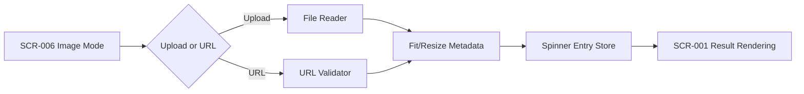

### 7.6 DATA-006: Round Addition with Previous-Round Cloning
**Flow ID:** DATA-006  
**Source:** Add Round action in SCR-003.  
**Transformations:** Clone previous round spinner entries/images; assign fixed quota by new position; assign default generated name.  
**Destination:** Updated rounds collection in state and local storage.  
**Payload Summary:** new round object with cloned spinner arrays, fixed quota, default name.  
**Trigger:** Valid Add Round click when round count < 6.

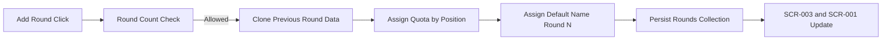

### 7.7 DATA-007: Pause/Resume State Persistence
**Flow ID:** DATA-007  
**Source:** Pause/Resume control on SCR-001.  
**Transformations:** Toggle paused flag while retaining active round/player and counters.  
**Destination:** Local storage snapshot and gameplay execution guard.  
**Payload Summary:** `{paused, activeRound, activePlayer, turnCounters, latestTurn}`.  
**Trigger:** Pause or Resume action.

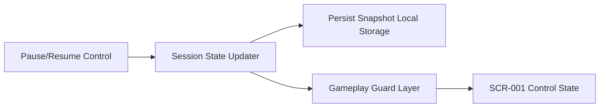

## 8. Assumptions & Clarifications Log

### 8.1 Requirement ID Mapping (FR -> SOW-REQ)
| FR ID | Assigned SOW Requirement ID | Description |
|---|---|---|
| FR-1 | SOW-REQ-001 | Two fixed players; strict alternation |
| FR-2 | SOW-REQ-002 | Only active player can spin |
| FR-3 | SOW-REQ-003 | Exactly three outcomes in fixed order |
| FR-4 | SOW-REQ-004 | Uniform random spinner outcome selection |
| FR-5 | SOW-REQ-005 | Empty spinner fallback text |
| FR-6 | SOW-REQ-006 | Show text+image when both configured |
| FR-7 | SOW-REQ-007 | History shows only opponent most recent prior turn text |
| FR-8 | SOW-REQ-008 | Blank history when no opponent prior turn |
| FR-9 | SOW-REQ-009 | Start with 4 rounds; add up to 6 |
| FR-10 | SOW-REQ-010 | Added round clones previous round content/limits |
| FR-11 | SOW-REQ-011 | Added rounds auto-named until edited |
| FR-12 | SOW-REQ-012 | Round progression follows dashboard order; no reorder |
| FR-13 | SOW-REQ-013 | Fixed non-editable turn limits by position |
| FR-14 | SOW-REQ-014 | Immediate auto-advance on quota completion |
| FR-15 | SOW-REQ-015 | Final configured round repeats indefinitely |
| FR-16 | SOW-REQ-016 | Pause and Resume preserve state |
| FR-17 | SOW-REQ-017 | Dashboard accessible without authentication |
| FR-18 | SOW-REQ-018 | Dashboard edits apply immediately to gameplay |
| FR-19 | SOW-REQ-019 | Spinner images support upload and URL |
| FR-20 | SOW-REQ-020 | Persist config and gameplay in local storage |
| FR-21 | SOW-REQ-021 | Rules are free text only |
| FR-22 | SOW-REQ-022 | Clear current-round and active-player indicators |

### 8.2 Assumptions
- [ASSUMPTION] Invalid image URL behavior default: keep entry text active and display image placeholder/non-rendered image state.
- [ASSUMPTION] Corrupted or missing local storage defaults to fresh 4-round initialization without blocking gameplay.
- [ASSUMPTION] Dashboard changes auto-save on field change/blur (no explicit Save-all action).
- [ASSUMPTION] Round name empty input defaults back to auto-generated `Round N`.
- [ASSUMPTION] Spinner entry minimum content rule defaults to at least one of text or image.
- [ASSUMPTION] Optional deep-link query for dashboard tab selection (`?tab=rounds|spinners|rules`) to preserve navigation state.

### 8.3 Clarifications Needed
- [CLARIFICATION NEEDED] For first-time launch, should default spinner entries/rules ship pre-populated, or should all spinner pools start empty with fallback labels only?

## 9. Design Notes & Recommendations
[DESIGN NOTE]
1. **Acknowledge:** The SOW intentionally allows unrestricted dashboard access to keep setup friction low for shared local play.
2. **Concern:** During active play, accidental edits can change spinner pools mid-session and surprise players.
3. **Alternative:** Add optional lightweight confirmation for destructive edits (delete entry, add round) and visible “last updated” indicator on gameplay.
4. **Implement:** This design keeps unrestricted no-auth dashboard access exactly as required by [SOW-REQ-017] and immediate propagation per [SOW-REQ-018].

[DESIGN NOTE]
1. **Acknowledge:** Free-text rules keep the product flexible and simple.
2. **Concern:** Users may expect rule automation if rules are prominently editable.
3. **Alternative:** Add helper microcopy under rules editor: “Rules are informational only; game flow is enforced by turn and round logic.”
4. **Implement:** Rules remain free-text display only per [SOW-REQ-021].

## 10. Requirements Traceability Matrix
| SOW Requirement ID | Requirement Description | Screen(s) | Journey Step(s) | Process Flow Step(s) | Data Flow(s) | Status |
|---|---|---|---|---|---|---|
| SOW-REQ-001 | Two fixed players and strict alternation | SCR-001 | UJ-P1-Step-1, UJ-P1-Step-5, UJ-P2-Step-1, UJ-P2-Step-4 | FLOW-002 Step 5 | DATA-002, DATA-007 | ✅ Covered |
| SOW-REQ-002 | Only active player can trigger Spin | SCR-001 | UJ-P1-Step-2, UJ-P2-Step-1 | FLOW-002 Step 1-2 | DATA-002 | ✅ Covered |
| SOW-REQ-003 | Three outcomes in fixed order Part/Action/Timer | SCR-001, SCR-004 | UJ-P1-Step-3, UJ-P2-Step-3 | FLOW-002 Step 3 | DATA-002 | ✅ Covered |
| SOW-REQ-004 | Uniform random outcome selection | SCR-001, SCR-004 | UJ-P1-Step-3, UJ-P2-Step-3 | FLOW-002 Step 3 | DATA-002 | ✅ Covered |
| SOW-REQ-005 | Empty spinner fallback text | SCR-001, SCR-004 | UJ-P1-Step-3, UJ-P2-Step-3 | FLOW-002 Step 4 | DATA-002 | ✅ Covered |
| SOW-REQ-006 | Show text and image when both configured | SCR-001, SCR-006 | UJ-P1-Step-4, UJ-P1CFG-Step-2 | FLOW-002 Step 4, FLOW-004 Step 3 | DATA-002, DATA-005 | ✅ Covered |
| SOW-REQ-007 | History shows opponent most recent prior turn text only | SCR-001 | UJ-P1-Step-5, UJ-P2-Step-2 | FLOW-002 Step 6 | DATA-003 | ✅ Covered |
| SOW-REQ-008 | Blank history when no opponent prior turn | SCR-001 | UJ-P1-Step-5, UJ-P2-Step-2 | FLOW-002 Step 6 | DATA-003 | ✅ Covered |
| SOW-REQ-009 | Start with 4 rounds and add up to 6 | SCR-003 | UJ-P1CFG-Step-5 | FLOW-006 Step 1-2 | DATA-006, DATA-001 | ✅ Covered |
| SOW-REQ-010 | Added rounds clone previous round entries/images/limits | SCR-003 | UJ-P1CFG-Step-5 | FLOW-006 Step 3 | DATA-006 | ✅ Covered |
| SOW-REQ-011 | Added rounds auto-generated names until edited | SCR-003 | UJ-P1CFG-Step-5 | FLOW-006 Step 3 | DATA-006 | ✅ Covered |
| SOW-REQ-012 | Round order top-to-bottom, no reordering | SCR-003, SCR-001 | UJ-P1-Step-6, UJ-P1CFG-Step-5 | FLOW-003 Step 3, FLOW-006 Step 4 | DATA-006 | ✅ Covered |
| SOW-REQ-013 | Fixed non-editable quotas 10,10,5,2,2,2 | SCR-003, SCR-001 | UJ-P1-Step-6, UJ-P1CFG-Step-5 | FLOW-003 Step 1-2, FLOW-006 Step 3 | DATA-006, DATA-001 | ✅ Covered |
| SOW-REQ-014 | Immediate auto-advance when both quotas met | SCR-001 | UJ-P1-Step-6, UJ-P2-Step-4 | FLOW-003 Step 2-4 | DATA-001 | ✅ Covered |
| SOW-REQ-015 | Final configured round continues indefinitely | SCR-001 | UJ-P1 Exit, UJ-P2 Exit | FLOW-003 Step 4 | DATA-001 | ✅ Covered |
| SOW-REQ-016 | Pause and Resume preserve state | SCR-001 | UJ-P2PR-Step-1, UJ-P2PR-Step-3 | FLOW-005 Step 1-3 | DATA-007 | ✅ Covered |
| SOW-REQ-017 | Dashboard accessible without authentication | SCR-002 | UJ-P1CFG-Step-1 | FLOW-004 Step 1 | DATA-004 | ✅ Covered |
| SOW-REQ-018 | Dashboard edits apply immediately to gameplay | SCR-002, SCR-003, SCR-004, SCR-005, SCR-006, SCR-001 | UJ-P1CFG-Step-1, UJ-P1CFG-Step-2, UJ-P1CFG-Step-4, UJ-P1CFG Exit | FLOW-004 Step 2-3 | DATA-004 | ✅ Covered |
| SOW-REQ-019 | Spinner images via upload and URL | SCR-004, SCR-006 | UJ-P1CFG-Step-3 | FLOW-004 Step 1, FLOW-004 Step 2 | DATA-005 | ✅ Covered |
| SOW-REQ-020 | Persist configuration and gameplay in local storage | SCR-001, SCR-002 | UJ-P1CFG Exit, UJ-P2PR-Step-2 | FLOW-001 Step 1-3, FLOW-005 Step 1-3 | DATA-001, DATA-004, DATA-007 | ✅ Covered |
| SOW-REQ-021 | Rules free text only | SCR-005, SCR-001 | UJ-P1CFG-Step-4 | FLOW-004 Step 1-3 | DATA-004 | ✅ Covered |
| SOW-REQ-022 | Clear current-round and active-player indicators | SCR-001 | UJ-P1-Step-1, UJ-P2-Step-1, UJ-P2-Step-4 | FLOW-001 Step 3, FLOW-002 Step 5 | DATA-001, DATA-002 | ✅ Covered |

## 11. Self-Validation Report

**Validation Date:** 2026-03-15

### Coverage Summary
- Total SOW Requirements: 22
- ✅ Fully Covered: 22
- ⚠️ Partially Covered: 0 — none
- ❌ Not Covered: 0 — none
- Orphaned References Found: 0 — none

### Consistency Summary
- Screen Reference Mismatches: 0 — none
- Persona Name Inconsistencies: 0 — none
- Navigation Integrity Issues: 0 — none
- Mermaid Syntax Issues: 0 — none

### Tag Audit
- [ASSUMPTION] tags: 7 total, 7 with proposed defaults, 0 missing defaults
- [CLARIFICATION NEEDED] tags: 1 total, 1 with specific questions, 0 vague
- [DESIGN NOTE] tags: 2 total, 2 following full pattern, 0 incomplete

### Validation Verdict
- [x] ✅ PASS — Document is internally consistent and fully traceable.
- [ ] ⚠️ CONDITIONAL PASS — Minor issues noted. Recommend PO review of flagged items.
- [ ] ❌ FAIL — Critical gaps found. Requires remediation before PO validation.